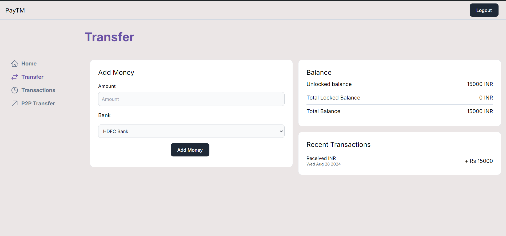
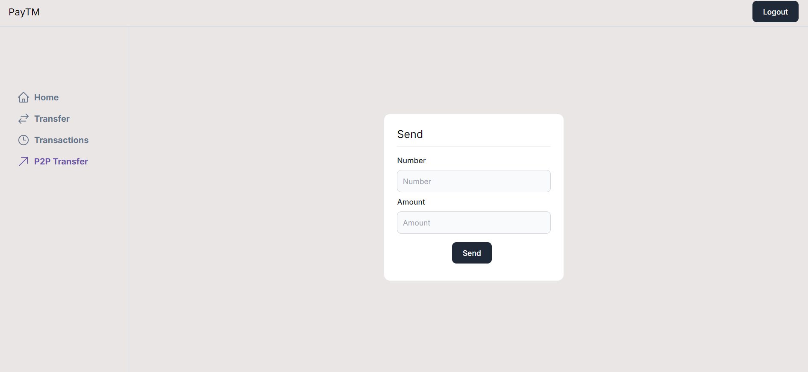

- Clone the repo

```jsx
git clone https://github.com/abhishekpandey1880/Wallet-Pay.git
```

- npm install
- Run postgres either locally or on the cloud (neon.tech)

- Copy over all .env.example files to .env
- Update .env files everywhere with the correct db url
- Go to `packages/db`
    - npx prisma migrate dev
    - npx prisma db seed
- Go to `apps/user-app` , run `npm run dev`
- Try logging in using phone - 1111111111 , password - alice (See `seed.ts`)

## Some Images of The App


